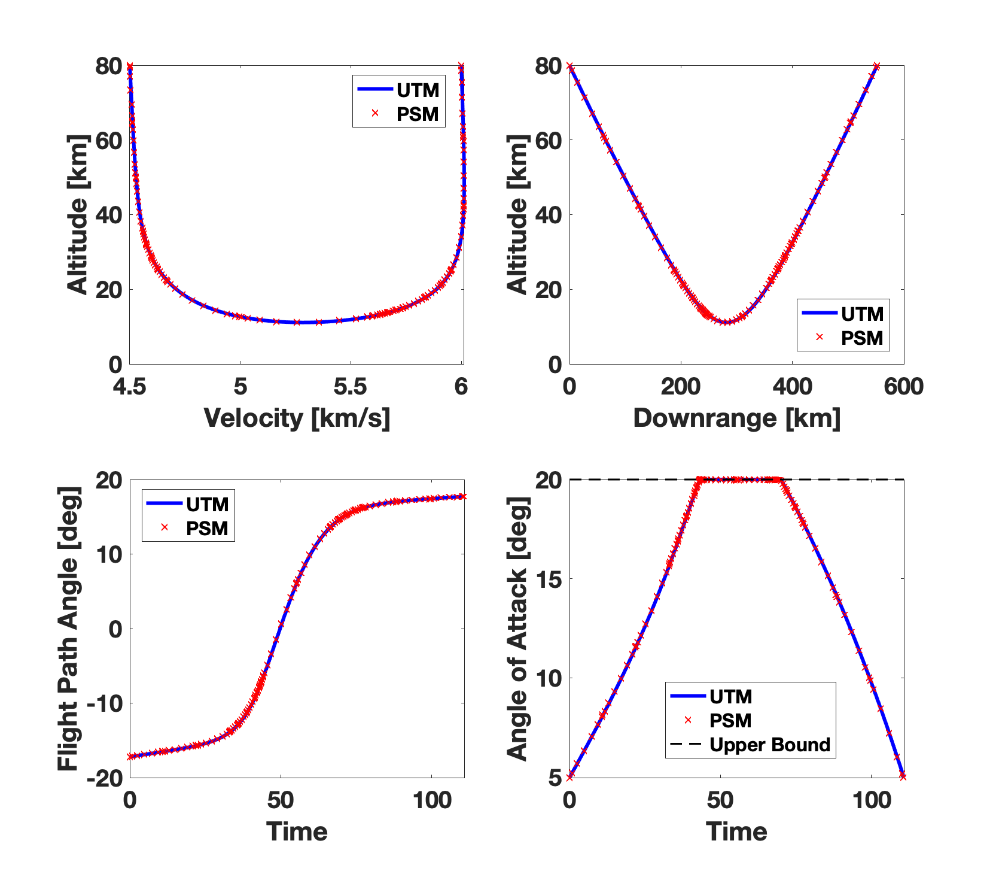

==============================================================
Rapid Optimal Control Software with UTM Implementation
==============================================================

:Author: Michael J. Grant, Kshitij Mall, and Thomas Antony
:Contact: mjgrant@auburn.edu
:URL: https://github.com/Rapid-Design-of-Systems-Laboratory/rocs

Description
----------------

This repository contains the necessary library and source files needed to setup, run, and solve complicated optimal control problems (OCPs) using the Unified Trigonometrization Method (UTM). A detailed documentation for this UTM framework is in progress. Sample results genertated for a Mars aerocapture problem using this framework are shown below. 

Running a Sample Problem
------------------------

Use the following steps to setup and run a sample Mars aerocapture problem with constraints upon the angle-of-attack control. 

**Step 1:** Download or clone this repository and browse inside the main folder.

**Step 2:** Run the following step using MATLAB's command line. 
::
  $ startup

This startup file adds library files to the search path. 

**Step 3:** Step 2 would automatically take you to the *problems* folder. Browse to the *Non-Linear Control Constraints Problems* and then to the *Mars_Aerocapture*. In the command window type 
::
  $ runSolver

**Step 4:** Step 3 would create the *autocode* and *data* folders if they are not already present in the current working space. Once all the numerical continuation steps are solved, the results are save as **results.mat** inside the *data* folder. To visualize the results you have two options. 
**Step 4 a:** Run through MATLAB's command window
::
  $ runAnalysis

Please make sure to check and modify *in.cont.index* inside the file **inputsAnalyzeOptimization.m**, which corresponds to the continuation set in the solution process. For instance, if you want to see the results of the continuation set 2 just set in.cont.index = 2.

**Step 4 b:** Run through MATLAB's command window the following comparison file to see the validity of the results obtained using the UTM with GPOPS-II. 
::
  $ bounded_control_comp_plots
  

Setting Up a Sample Problem
---------------------------
In order to formulate your own interesting problem in this framework, use the following steps. The following steps assume that you have already run the startup.m file. 

**Step 1:** Browse to the *problems* folder. You can choose to make a new folder inside the *problems* folder or you can browse inside the relevant sub-folders based on the type of your problem (bang-bang and singular, non-linear constrained controls, problems with state constraints or unconstrained problems. 

**Step 2:** Create and name the *main* file of your interesting problem. 

**Step 3 a:** To generate the required *dynamics*, *boundary conditions*, and *optimal control* file, write the following line of code in your main file.
::
  in.oc.writeEquations = true; 

**Step 3 b:** In order to provide an *initial guess* based on the results from the continiuation steps with a fixed number of mesh points set the following:
::
  in.useDeval = true;

**Step 4 a:** For scaling the problem use:
::
  in.autoScale = true;
  
**Step 4 b:** Setup the *scaling* on the units (m, s, kg, etc.) or the variables of interest (altitude, velocity, etc.) use:
::
  in.scale = {'m','x1'; ... % x1 is the first state, altitude
              'rad',1; ...
              's','x1/x3'; ... % x3 is the third state, velocity. x1/x3 = time
              'kg','const.mass'; ...
              'nd',1}; % nd = nondimensional

The above scaling example corresponds to the Mars aerocapture problem, in which *x1* is the altitude and *x3* is the velocity. 

**Step 5 a:** Setup the *independent* variable for the problem using:
::
  in.oc.independentVariable = {'t','s'}; % time
  
**Step 5 b:** Setup the *dependent* variables for the problem using:
::
  in.oc.state = {'h','m'; ... % altitude
		             'thetta','rad'; ... % longitude, positive eastward
		             'v','m/s'; ... % relative velocity
		             'gam','rad'}; %... % relative flight-path angle 
                 
**Step 6 a:** Write the trigonometric expression for the control(s) to be used by the UTM framework. 
::
  alfa = '(alfamax*sin(alfatrig))';

**Step 6 b:** Write the expressions that are needed in equations of motion. 
::
  Cl  = ['(Cl1*',alfa,'+ Cl0)']; % Coefficient of lift
  Cd  = ['(Cd2*',alfa,'^2 + Cd1*',alfa,'+ Cd0)']; % Coefficient of drag
  rho = '(rho0*exp(-h/H))'; % Exponential Atmospheric Density [kg/m^3]
  D   = ['(1/2*',rho,'*v^2*',Cd,'*Aref)']; % Drag Force [N]
  L   = ['(1/2*',rho,'*v^2*',Cl,'*Aref)']; % Lift Force [N]
  
**Step 6 c:** Setup the *equations of motion* for the problem using:
::
  in.oc.stateRate = {'v*sin(gam)'; ...
				             'v*cos(gam)/(re+h)'; ...
				             ['-',D,'/mass - mu*sin(gam)/(re+h)^2']; ...
				             [L,'/(mass*v) + (v/(re+h) - mu/(v*(re+h)^2))*cos(gam)']};

**Step 7 a:** Define the *trigonometric control(s)* needed to solve the problem. 
::
  in.oc.control = {'alfatrig','rad'}; % angle of attack control
  
**Step 7 b:** Define the *path*, *initial*, and *terminal* objectives for the problem. For a minimum time problems, choose *path cost* as 1. Right now, this architecture is unable to handle time in *teminal cost* field for minimum time problems. 
::  
  % Path cost
  in.oc.cost.path = {'1','s'};

  % Terminal cost
  in.oc.cost.terminal = {'0','s'};

  % Initial cost
  in.oc.cost.initial = {'0','s'};

**Step 7 c:** Define the *endpoint constraints*.
:: 
  % Initial constraint
  in.oc.constraint.initial = {'h-x0(1)','m'; ...
                              'thetta-x0(2)','rad'; ...
                              'v-x0(3)','m/s'};

  % Terminal constraint
  in.oc.constraint.terminal = {'h-xf(1)','m'; ... 
                               'v-xf(3)','m/s'};

**Step 8:** Write the constants needed to solve your problem. 
::
  %%%%%%%%%%%%%%%
  %% Constants %%
  %%%%%%%%%%%%%%%

  in.const.mu      = {42828.371901*1e9,'m^3/s^2'}; % Gravitational parameter, m^3/s^2
  in.const.rho0    = {0.02,'kg/m^3'}; % Sea-level atmospheric density, kg/m^3
  in.const.H       = {11100,'m'}; % Scale height for atmosphere of Earth, m
  in.const.mass    = {92080,'kg'}; % Mass of vehicle, kg
  in.const.re      = {3397000,'m'}; % Radius of planet, m
  in.const.Aref    = {250,'m^2'}; % Reference area of vehicle, m^2
  in.const.alfamax = {20*pi/180,'rad'}; % Maximum value for the angle of attack control
  in.const.Cl1     = {1.6756,'nd'};
  in.const.Cl0     = {-0.2070,'nd'};
  in.const.Cd2     = {2.04,'nd'};
  in.const.Cd1     = {-0.3529,'nd'};
  in.const.Cd0     = {0.0785,'nd'};
  in.const.tol     = {1e-4,'nd'}; % Absolute and relative tolerances for bvp4c
  in.const.NMax    = {1e10,'nd'}; % Maximum mesh points for bvp4c
  in.const.NMesh   = {500,'nd'}; % Fixed number of mesh points while using MATLAB's deval function

**Step 9:** For initial guess, you can either create your own guess file or you can use auto mode to generate the guess. the auto mode is found to work very well for most of the problems and therefore is recommended to be tried first.
::
  in.oc.guess.mode          = 'auto';
  in.oc.guess.timeIntegrate = 10; % Time duration of the trajectory 

  % % Use automatic init
  % Conditions at entry
  in.oc.guess.initial.h      = 80e3;
  in.oc.guess.initial.thetta = 0*pi/180;
  in.oc.guess.initial.v      = 6000;
  in.oc.guess.initial.gam    = -30*pi/180;

**Step 10:** Your interesting optimal control problem is all set. 
::
  %%%%%%%%%%%%%%%%%%
  %% Continuation %%
  %%%%%%%%%%%%%%%%%%

  in.cont.method = 1; % 1 = manually changing parameters

  ind = 0;
  %%%%%%%%%%%%%%%%%%%%%
  % Continuation Set %% 
  %%%%%%%%%%%%%%%%%%%%%
  
  ind = ind+1;
  in.CONT{ind}.numCases = 100; % Number of steps in the continuation set
  in.CONT{ind}.constraint.terminal.v = 4500;
  in.CONT{ind}.constraint.terminal.h = 80e3;

  %%%%%%%%%%%%%%%%%%%%%
  % Continuation Set %% 
  %%%%%%%%%%%%%%%%%%%%%

  ind = ind+1;
  in.CONT{ind}.numCases  = 10;
  in.CONT{ind}.const.tol = linspace(0,-(1e-4-1e-6),in.CONT{ind}.numCases);

**Step 11:** Your interesting optimal control problem is all set. Create a file *runSolver.m* and inside this file write and save:
::
  if ~exist('./autocode','dir')
    mkdir('autocode');
  end
  if ~exist('./data','dir')
    mkdir('data');
  end

  runCombinedProcess(@yourmainfilename);

Note that *runCombinedProcess* uses the function handle correspnding to the name of your main file created using steps 1 to 10. To check analytical expressions generated for your interesting problem, go inside the *autocode* folder. To check the optimal control law options and the application of Pontryagin's Minimum Principle, open **computeControlUnconstrained.m**. To analyze the dynamics or equations of motion for this problem check **derivFunc.m** file. To check the boundary conditions for this problem, look into **bc.m**.

Analyzing the Solution
----------------------
In order to analyze the solution, you can use the **rersults.mat** file generated inside the *data* folder upon the completion of the continuation steps. You can alternatively copy, paste, and modify **/inputsAnalyzeOptimization.m** and **runAnalysis.m** files. You would need to speicfy the variables of interest that you need to plot on the x and y axes. Remember to change the *in.cont.Index* to plot the results from the continuation set of interest to you. The detailed documentation for this framework would contain more information about these plotting files. The results for the Mars aerocapture problem using this framework are the following. 

Documentation
-------------

The detailed documentation for this UTM framework is in progress.

Aknowledgements
---------------

`AAE 590 Hypersonics & Design <https://engineering.purdue.edu/~mjgrant/syllabus-2.pdf>`_ by Professor Michael Grant

`AAE 508 Optimization in Aerospace Engineering <https://engineering.purdue.edu/online/sites/default/files/documents/syllabi/f2015_aae508.pdf>`_ by Professor James Longuski

.. Local Variables:
.. mode: text
.. coding: utf-8
.. fill-column: 70
.. End:
